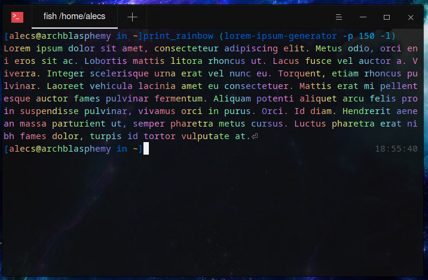

# rainbow-fish
A simple util function to print rainbow text in fish shell!

## Output example


## Rainbow prompt
You can use it to make your fish prompt multy color!

``` fish
function fish_prompt

    set_color blue --bold
    printf "["

    set_color normal
    print_rainbow "$USER@$hostname"

    set_color normal
    set_color blue --bold
    printf " in "

    set_color normal
    print_better_pwd yellow #print_better_pwd it's another custom function replace it with your own

    set_color normal
    set_color blue --bold
    printf "]"

    set_color normal
    
end

```


``` java
for(var e : myArray)
```
